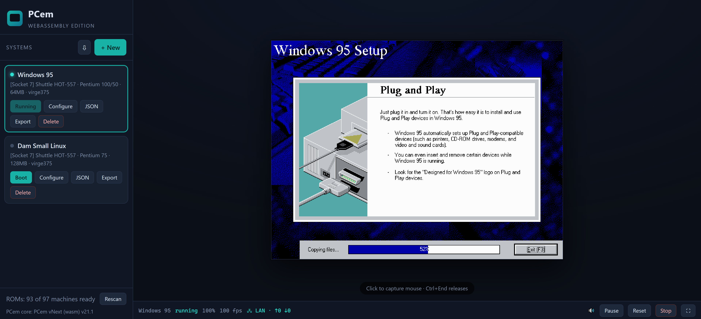

# PCem — WebAssembly edition

A port of the [PCem](https://pcem-emulator.co.uk/) PC emulator to the browser.
The native wxWidgets/Qt front end is replaced by a headless Emscripten build
of the emulation core and a single-page web app that recreates PCem's
"Systems" workflow: define machines, attach media, boot. Everything runs
client-side; the server only hosts static files and a ROM directory.

This is an unofficial port. PCem itself is by Sarah Walker and contributors;
the emulation fidelity is theirs.

Live Demo at https://citizenlink.net

## What it does

The full PCem device inventory is compiled in: 97 machine models from the
8088 XT through Socket 7, with the video, sound, storage and input hardware
the desktop version registers. Enumerated live from the same device tables,
including each device's own configuration dialog (Sound Blaster resources,
Voodoo memory/threads/SLI, display types, and so on).

Some parts had to be rebuilt for the browser rather than merely recompiled:

* Emulation runs on a dedicated worker thread. A guest that emulates slower
  than real time runs in slow motion; the page never freezes.
* 3dfx Voodoo rendering goes through a runtime WebAssembly recompiler that
  compiles the span pipeline per render state — textured (single and dual
  TMU), fogged, blended, dithered, both span directions. Every covered mode
  is verified byte-identical against PCem's C rasteriser by an automated
  A/B oracle; anything the recompiler can't prove falls back to the C path.
* An optional CPU recompiler translates PCem's IR to WebAssembly at runtime.
  It is off by default and honestly labelled: it wins substantially on
  compute-heavy guests.
* A differential oracle can run every compiled block in lockstep with the
  interpreter to prove bit-exactness.
* Audio streams through an AudioWorklet reading lock-free rings directly
  from shared memory, with pre-roll, drift compensation and an adaptive
  cushion. At full guest speed it plays with zero underruns.
* Hard disk images of any size attach from local files without uploading or
  staging: reads fault in lazily (128 KB blocks, batched fetches, 64 MB
  cache) and guest writes stay in a session-only overlay — the source file
  is never modified. Floppies and ISOs mount through the File API; hosted
  images stream via HTTP range requests. A per-disk **Download image**
  button saves any image back to your computer with the session's guest
  writes merged in (fixed VHDs come back as valid VHDs).
* Machine configs are plain JSON (saved in localStorage, exportable). An
  Export function writes a hostable folder so a `?system=` link boots your
  exact machine, disks included, for anyone you send it to.
* Networking: an NE2000 (ISA) or RTL8029AS (PCI) whose frames travel over a
  WebSocket relay. Every machine pointed at the same relay shares a virtual
  LAN, which makes browser-to-browser multiplayer (IPX DOOM, file sharing)
  "use the same URL". A public relay is baked in as the zero-config default;
  each system can instead pick **Tabs in this browser** (a serverless LAN
  between tabs. The fastest way to try multiplayer against yourself), a
  custom relay URL, or off, and `tools/net_relay.mjs` is a self-hostable
  zero-dependency hub. PCem's own networking core compiles unmodified — the
  browser backend sits behind a libslirp-shaped shim.
* Host gamepads map onto the emulated game port through the Gamepad API
  (per-system on/off toggle, all seven of PCem's joystick types, d-pad as
  the POV hat), and the emulated MPU-401's MIDI stream plays through a real
  or software synth via WebMIDI — with the same per-card "MIDI out device"
  row the desktop dialogs have.

## Running it

You need a browser that allows `SharedArrayBuffer` (any current Chrome,
Edge or Firefox) and a server that sends the cross-origin-isolation headers
the pthreads build requires:

    Cross-Origin-Opener-Policy: same-origin
    Cross-Origin-Embedder-Policy: require-corp

For local use, the bundled dev server sets these for you:

    python3 serve.py        # http://localhost:8000

For production, copy `web/` to your host and add the two headers in your
Apache/nginx config.

ROMs are not distributed with this project, same as desktop PCem. Copy your
existing PCem `roms/` directory to `web/roms/` on the server (or point the
dev server at it with `--roms`); sets are fetched on demand and the machine
list shows what your collection supports. In the app: **+ New**, pick a
machine, attach media on the Media tab, save, boot. Click the display to
capture the mouse; `Ctrl+End` releases it.

## Building from source

Toolchain: Emscripten 3.1.52, LLVM 18 (clang/wasm-ld), Binaryen 115. If you
have emsdk, activate it and run `./build.sh`. In environments where emsdk's
binary downloads are blocked, `./tools/setup-toolchain.sh` assembles the
same toolchain from git checkouts plus a system LLVM 18 and builds Binaryen
from source.

    ./tools/setup-toolchain.sh          # once
    export PATH="$HOME/emscripten:$PATH"
    ./build.sh                          # outputs into web/pcem/

## Tests

`tools/` contains the regression suite, run with Node + Playwright against a
real headless Chromium:

    node tools/smoke_test.mjs        # boot to CGA test card, pixel-verified
    node tools/voodoo_ab_test.mjs    # Voodoo JIT vs C rasteriser, byte-exact
    node tools/jit_oracle_test.mjs   # CPU JIT vs interpreter, bit-exact
    node tools/audio_test.mjs        # underrun-free delivery + recovery
    node tools/bigdisk_test.mjs      # multi-GB lazy disks, COW writes
    node tools/interp_cpu_test.mjs   # interpreter fallback path
    node tools/devcfg_test.mjs       # device config dialogs end-to-end
    node tools/editor_test.mjs       # machine editor
    node tools/net_test.mjs          # two browsers + local relay: frames byte-exact both ways
    node tools/net_local_test.mjs    # tabs-LAN (BroadcastChannel): serverless, byte-exact
    node tools/gamepad_test.mjs      # Gamepad API -> guest joystick state, POV, off-switch
    node tools/midi_test.mjs         # guest MPU-401 -> WebMIDI, running status reassembled
    node tools/download_test.mjs     # per-disk download: overlay merged, VHD footer restored
    node tools/jit_bench.mjs         # honest interpreter-vs-JIT numbers

Test ROMs for the synthetic boot tests are generated with
`python3 tools/make_test_rom.py` — no copyrighted BIOS needed for those.

## Performance, honestly

A mid-range desktop holds a Pentium 90class machine at 100% with clean
audio, including 3D-accelerated titles through the Voodoo recompiler. CPU
models are labelled by emulation cost in the editor ("demanding" from
60 MHz, "very demanding" from 120 MHz), and a machine that can't sustain
real time tells you so once and points at the fix, instead of silently
stuttering. Cycle-paced emulation is expensive by design. If a model runs
below 100% on your hardware, pick a lower one; that is the machine your
browser can actually be.

## Documentation

`PORTING_NOTES.md` is the engineering record: every core patch, every
browser-specific subsystem, measured numbers for the recompilers, and the
reasoning behind each decision. `docs/BLOCK_CHAINING_PLAN.md` is the worked
design for the next CPU JIT stage.

## License

GPL v2, same as PCem — see `COPYING`. Upstream:
<https://github.com/sarah-walker-pcem/pcem>. BIOS ROM images remain the
property of their respective owners; supply your own.
